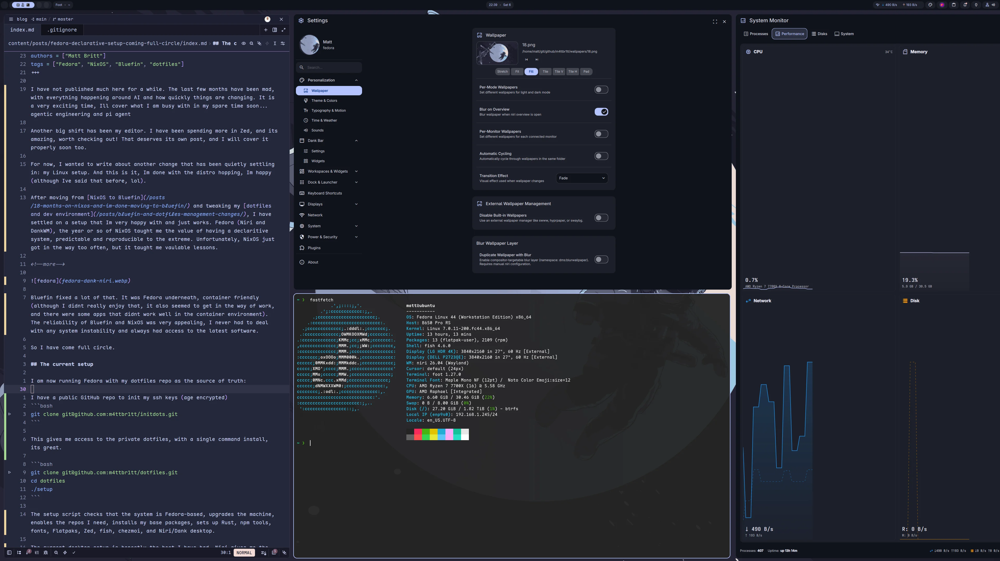

+++
draft = false
date = 2026-06-06T21:50:00+02:00
title = 'Fedora declarative setup: coming full circle'
description = "Moving from NixOS to Bluefin, then landing on Fedora with a custom declarative setup."
slug = "fedora-declarative-setup-coming-full-circle"
authors = ["Matt Britt"]
tags = ["Fedora", "NixOS", "Bluefin", "dotfiles"]
+++

I have not published much here for a while. The last few months have been mad, with everything happening around AI and how quickly things are changing. It is a very exciting time, Ill cover what I am busy with in my spare time soon... agentic engineering and pi agent

Another big shift has been my editor. I have been spending more in Zed, and its amazing, worth checking out! That deserves its own post, and I will cover it properly soon too.

For now, I wanted to write about another change that has been quietly settling in: my Linux setup. And this is it, Im done with the distro hopping, Im happy (although Ive said that before, lol).

After moving from [NixOS to Bluefin](/posts/18-months-on-nixos-and-im-done-moving-to-bluefin/) and tweaking my [dotfiles and dev environment](/posts/bluefin-and-dotfiles-management-changes/), I have settled on a setup that Im very happy with and just works. Fedora (Niri and DankWM), the year or so of NixOS taught me the value of having a declaritive system, predictable and reproducible to the extreme. Unfortunately, NixOS just got in the way too often, but it taught me valuable lessons.

<!--more-->



Bluefin fixed a lot of that. It was Fedora underneath, container friendly (although I didnt really enjoy that, it also seemed to get in the way of work, and there were some apps that didnt work well in the container environment). The reliability of Bluefin and NixOS was very appealing, I never had to deal with any system instability and always had access to the latest software. 

So I have come full circle.

## The current setup

I am now running Fedora with my dotfiles repo as the source of truth:

I have a public GitHub repo to init my ssh keys (age encrypted)
```bash
git clone git@github.com:m4ttbr1tt/initdots.git
```

This gives me access to the private dotfiles, with a single command install, its great.

```bash
git clone git@github.com:m4ttbr1tt/dotfiles.git
cd dotfiles
./setup
```

The setup script checks that the system is Fedora-based, upgrades the machine, enables the repos I need, installs my base packages, sets up Rust, npm tools, fonts, Flatpaks, Zed, fish, chezmoi, and Niri/Dank desktop.

The current desktop setup is honestly the best I have had. Niri gives me the keyboard-driven, and Dank brings the polish around it. It feels fast, minimal, and beautiful without becoming another full-time ricing project. I get the window-manager workflow I love, but with a setup that still feels stable and practical for real work.

## Declarative enough

This is not NixOS. I am not pretending it is (and Im glad)

It is declarative enough for what I actually need:

- packages are listed in arrays
- dotfiles are managed with chezmoi
- repos are cloned consistently
- setup is repeatable on a fresh Fedora install

The difference is that when something does not fit the model, I can just use Fedora normally. RPMs, Flatpaks, COPRs, shell scripts, systemd units. No drama. 

And in the worse case I can be backup and running in 10 minutes.

## The lesson

Fedora plus a boring setup script gives me most of what I liked about NixOS, without the restrictions that made me leave it. It also gives me the flexibility I liked in Bluefin, without being tied to an opinionated image.

For now, this feels like the sweet spot: declarative where it helps, normal Linux where it matters, and a Niri + Dank desktop that looks and feels amazing. I highly recommend looking into those projects.
